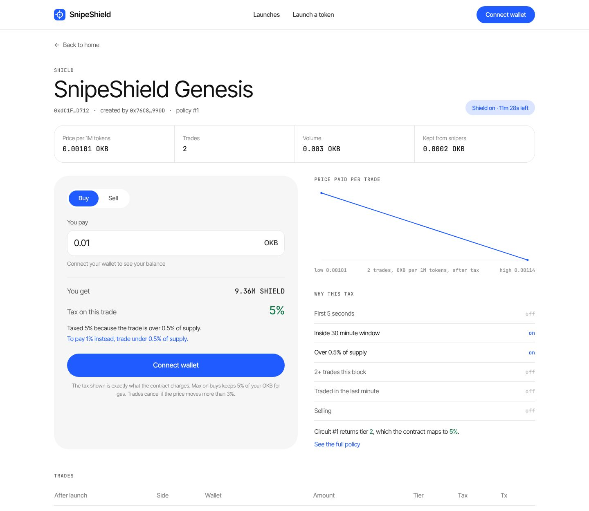
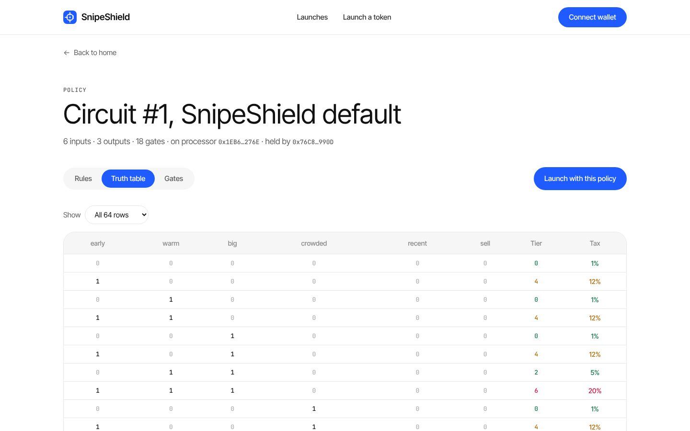
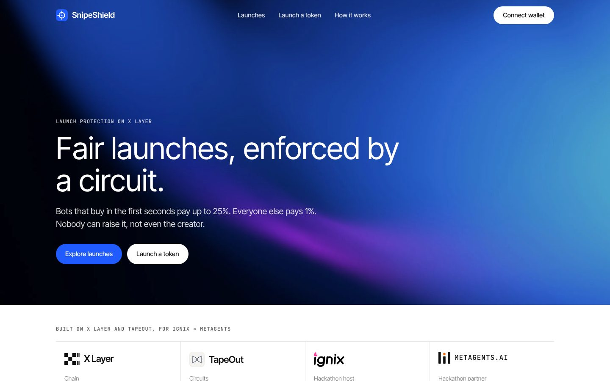

# SnipeShield

**Live app:** https://snipeshield.midelabs.xyz

Fair token launches on X Layer. Bots that buy in the first seconds pay up to 25%, everyone else pays 1%, and nobody can raise it, not even the creator. The tax rule is a public NAND circuit taped out on [TapeOut](https://www.tapeout.net).



## The problem

New launches get sniped in their first blocks. The usual defense is a high launch tax, but an adjustable tax is also the classic rug: the creator raises the sell tax and buyers are trapped. A buyer can't tell a protective tax from a predatory one, so they either get sniped or get rugged.

SnipeShield separates the two. The rule that decides the tax is a circuit anyone can read and run. The table it maps to is a constant with a 25% ceiling. Neither can be changed once a token launches.

## How it works

```
trade -> 6 signals packed into bits -> eval() on the TapeOut circuit -> tier 0-7 -> fixed tax table (max 25%)
```

For the first 30 minutes after launch (1800 X Layer blocks), every buy and sell is scored on chain:

| Bit | Signal |
|---|---|
| 0 | First 5 blocks after launch |
| 1 | Inside the 30 minute window |
| 2 | Trade over 0.5% of supply |
| 3 | 2 or more trades already in this block |
| 4 | Trader traded in the last 60 blocks |
| 5 | Sell |

The circuit returns a tier, and the contract maps it to `1, 3, 5, 8, 12, 15, 20, 25%`. After the window the circuit is skipped and every trade pays 1%.

The default policy is 18 NAND gates:

```
A = early OR (big AND crowded)
B = warm AND (big OR crowded OR (sell AND recent))
C = warm AND (recent OR sell)
tier = 4A + 2B + C
```



## Why the rule lives in a TapeOut circuit

A tax rule written in Solidity is only as trustworthy as whoever can upgrade it, and a buyer has to read code to check it. A TapeOut circuit is different on three counts:

- **Inspectable.** `netlist()` returns the exact gates, and `eval()` runs any input for free. The app shows all 64 rows of the policy, read live from the processor.
- **Shared and reusable.** One policy circuit serves every token that chooses it. Anyone can tape out a stricter or softer policy on the SHIELD processor and launch with it.
- **Fixed per token.** A token stores a `(processor, circuitId)` pair at launch and has no function to change it.

SnipeShield uses TapeOut as runtime logic. Every trade in the window calls `eval()` on the circuit.

| TapeOut piece | How SnipeShield uses it |
|---|---|
| Processor (`createCPU`) | The SHIELD processor hosts launch policies |
| Transistors (ERC-1155) | Minted and burned to tape out each policy |
| `tapeout(netlist)` | The default policy is compiled from `policy/default.js` and taped out byte for byte |
| `eval(circuitId, input)` | Called on every trade during the protection window |
| `circuitInfo`, `isCPU` | The launcher rejects any circuit that isn't a stateless 6-in, 3-out policy on a registered TapeOut processor |
| `netlist(circuitId)` | The app reads the gates and shows them next to the truth table |

## Live on X Layer mainnet

| Contract | Address |
|---|---|
| SHIELD processor (TapeOut Circuits) | [0x1EB66F2b96F8E861b20B2F93b66c99F0ea86276E](https://www.oklink.com/xlayer/address/0x1EB66F2b96F8E861b20B2F93b66c99F0ea86276E) |
| SHIELD transistors (ERC-1155) | [0x6733a381b6120d9cB73E1b9B03198DD1407edb33](https://www.oklink.com/xlayer/address/0x6733a381b6120d9cB73E1b9B03198DD1407edb33) |
| ShieldLauncher, source verified | [0x213149A7120F2d417DB5626607257b72687bf812](https://www.oklink.com/xlayer/address/0x213149A7120F2d417DB5626607257b72687bf812) |
| Default policy | Circuit #1, taped out in [0x290d6858…6709](https://www.oklink.com/xlayer/tx/0x290d685887917b3fb3be3e6c5832a5cc0ec8d6223c99191228c2fab12aae6709) |
| SnipeShield Genesis (SHIELD), source verified | [0xdC1F779B4024ff30C71BEB1D2C3913795946D712](https://snipeshield.midelabs.xyz/token/0xdC1F779B4024ff30C71BEB1D2C3913795946D712) |
| Deployer | [0x76C8B3A5ebCD1622cD232fd39F0B3e91DBDf990D](https://www.oklink.com/xlayer/address/0x76C8B3A5ebCD1622cD232fd39F0B3e91DBDf990D) |
| TapeOut factory | [0x1f09daefa827f02cbb40967cc91b259763760761](https://www.oklink.com/xlayer/address/0x1f09daefa827f02cbb40967cc91b259763760761) |

### The tax rule on a real launch

Two buys of SnipeShield Genesis, same wallet, same size (0.0015 OKB):

| Buy | Blocks after launch | Signals | Tier | Tax | Tx |
|---|---|---|---|---|---|
| Early | 4 | first 5 blocks, inside window | 4 | 12% | [0xaf3b…be87](https://www.oklink.com/xlayer/tx/0xaf3b102d3003cb44178b72110405066939c9a59e08abf7da07f92fa2a829be87) |
| Later | 83 | inside window | 0 | 1% | [0x0e85…5c95](https://www.oklink.com/xlayer/tx/0x0e8563bc607bc76da68f0be91419b00478a5adb94a0801b737c1fe08c8de5c95) |

These two are team test trades from a wallet we funded ([0xCd81…C8D5](https://www.oklink.com/xlayer/address/0xCd81069d7a3687d64605E51d654950cDC6a6C8D5)), made to show the policy firing on a real launch. They are not counted as user activity.

## Issuance

**SHIELD transistors.** The processor has a fixed supply of 1,000,000 transistors at 0.00001 OKB each, and supply is the only cap. The price is low on purpose. The processor exists to host policies, so taping one out should cost cents, not dollars. The default policy burned 18.

**Shielded tokens.** Every launch mints 1,000,000,000 tokens straight into a built-in constant-product curve with a 1 OKB virtual reserve. There's no presale and no team allocation. The creator earns 1% of each trade. Anything charged above 1% stays in the curve as OKB without minting tokens, which raises the price for every holder. A creator who snipes their own launch pays the penalty to the holders, not to themselves.

## What the contracts guarantee

- **The policy is fixed per token.** `ShieldToken` has no setter for the processor, circuit, tax table or cap. A test checks the full list of state-changing functions.
- **25% is a ceiling in code.** Even a malicious circuit can only pick a tier, and tier 7 is 25%.
- **Fail closed.** If `eval()` reverts or runs out of gas (capped at 400k), the trade is charged 25%, never more.
- **Slippage protection.** `buy(minOut)` and `sell(amount, minOut)` revert if the price moves. The app sets 3%.
- **No reentrancy.** Every OKB-moving function is guarded, and payouts happen after state updates.
- **Pull-based earnings.** The creator withdraws their 1% with `withdrawTax()`.
- **Trade history on chain.** Trades, volume and the penalty kept are stored on chain. Public X Layer RPCs cap log queries at 100 blocks, so the app reads contract state, not logs.

## The app

- **Launch page.** Shows the tax and the plain-language reason before you sign, plus how to pay less (for example, "To pay 1% instead, trade under 0.5% of supply"). That hint comes from asking the real circuit, not from client-side math. It also has a price chart built only from executed trades, and a creator panel for withdrawals.
- **Launch a token.** Validates any policy circuit on chain before the wallet opens, then launches in one transaction.
- **Policy inspector.** Shows the rules, a 64-row truth table from live `eval()`, and the decoded gates.
- **Launches.** Lists every shielded token with its window status, price and trades.



## Trade-offs and how they're handled

- **Bots that split buys across fresh wallets.** Splitting inside one block trips the crowded signal, and splitting across blocks after the first 5 means buying like a normal user, at a normal price. Launchers who want a stricter rule can tape out their own policy on the SHIELD processor and launch with it. No code changes are needed.
- **No wallet-age signal.** Wallet age can't be read on chain without an indexer, so the policy relies on signals the contract can prove: timing, size, block crowding and repeat trading.
- **TapeOut's factory isn't sealed yet,** so its owner can still upgrade how circuits are evaluated. SnipeShield is built so this can't hurt buyers. The 25% cap and the tier table live in SnipeShield's own immutable contract, and any evaluation failure falls back to that cap. The worst case is a capped tax, never a trapped one.
- **No third-party audit yet.** The contracts are small, have no owner or upgrade path, and have verified source on OKLink. They're covered by 16 tests that run against the real TapeOut factory on a fork of X Layer mainnet.

## Repository

```
contracts/   ShieldToken (curve, circuit-driven tax), ShieldLauncher, TapeOut interfaces
policy/      NAND netlist compiler and the default policy, checked against a reference on all 64 inputs
test/        Hardhat tests on a fork of X Layer mainnet against the real TapeOut factory
scripts/     deploy, genesis launch, sweep, web export
web/         Vite + React app
```

## Run it

```bash
npm install
npx hardhat test          # 16 tests on a fork of X Layer mainnet

cd web && npm install && npm run dev
```

## Built on

[X Layer](https://web3.okx.com/xlayer) for settlement and [TapeOut](https://www.tapeout.net) for policy circuits. Part of the [IGNIX](https://ignix.bot) launch ecosystem.

## License

MIT
